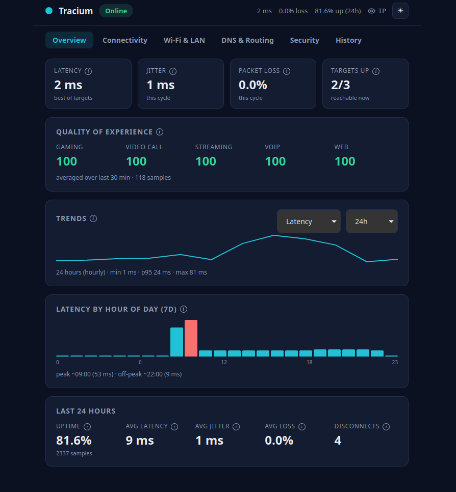

<p align="center">
  
</p>

<h1 align="center">Tracium</h1>

<p align="center">
  <strong>Know your network, inside and out.</strong>
</p>

<p align="center">
  A lightweight desktop monitor that watches your connection in real time and
  keeps a history, so you can see what happened while you were away.
</p>

<p align="center">
  
  
  
</p>

<p align="center">
  
</p>

---

## Why Tracium?

Most network tools are built for sysadmins: command-line flags, dense
dashboards, and jargon. Tracium is for people who care about their home
connection but don't want to run a monitoring stack.

It watches your connection continuously and tells you when something is wrong,
ideally before a call drops. Open the window to see what is happening now, and
what happened while you were away.

---

## What It Watches

### Internet Connectivity

- **Latency**: min, average, and max round-trip time.
- **Jitter**: how much latency varies between packets.
- **Packet loss**: percentage of probes that did not come back.
- **Internet uptime**: measured from your machine, not your ISP's claims.
- **Disconnect count**: how many times the connection dropped, and when.
- **Outage duration**: total time offline.
- **Time to reconnect**: how long it took to come back.
- **IPv4 and IPv6**: each stack monitored separately.

### Speed Tests

- **Download and upload speed**, on your schedule.
- **Ping and jitter during the test** (latency under load).
- **Packet loss under load.**
- **Speed vs. your ISP plan.**
- **Peak hour vs. off-peak.**
- **Full speed-test history.**

### Wi-Fi

- **Signal strength (RSSI)** in dBm.
- **Signal quality** as a percentage.
- **Link speed and PHY rate** (negotiated vs. actual).
- **Frequency band** (2.4, 5, or 6 GHz).
- **Channel and channel width.**
- **Noise level.**
- **Retransmission rate.**
- **Roaming events** between access points.

### Local Network

- **Gateway latency**: how fast your router responds.
- **LAN packet loss.**
- **Interface errors and drops** (low-level NIC counters).
- **Connected device count.**
- **Per-device bandwidth.**
- **Top bandwidth consumers.**
- **Router CPU and memory**, if the router exposes it.

### DNS

- **Lookup time**, per query and averaged.
- **Failure count.**
- **Which resolver answered.**
- **Side-by-side resolver comparison.**
- **Cache hit rate**, where available.

### Routing

- **Traceroute.**
- **Hop count.**
- **Per-hop latency.**
- **Route changes.**
- **Packet loss by hop.**
- **AS/ISP path** for each hop.

### Bufferbloat

- **Idle latency** as a baseline.
- **Latency under download load.**
- **Latency under upload load.**
- **Bufferbloat grade** (A to F).

### Reliability

- **Daily, weekly, and monthly uptime.**
- **Disconnect frequency.**
- **Average and longest outage.**

### Bandwidth Usage

- **Current download and upload rate.**
- **Daily, weekly, and monthly totals.**
- **Per-application breakdown.**
- **Per-device breakdown.**

### Quality of Experience

Scores that estimate how the connection feels for a given activity:

- **Gaming, video call, streaming, web browsing, and VoIP scores**, from
  latency, jitter, and loss.

### Security

- **Open ports.**
- **Public IP.**
- **NAT type** (open, moderate, or strict).
- **UPnP status.**
- **Firewall status.**
- **VPN detection.**
- **DNS-over-HTTPS/TLS status.**

### Historical Analytics

- **Hourly, daily, weekly, and monthly trends.**
- **Event timeline.**
- **Incident log.**
- **Exportable reports** (PDF and CSV).

---

## Bring your own AI

Tracium does not bundle an AI model or an insights engine. It makes your data
easy to hand to whatever assistant you already use.

- Export a summary as PDF (`traciumd report --pdf`) or the raw history as CSV
  (`traciumd export`), then paste it into ChatGPT, Claude, or similar and ask
  what is wrong and how to fix it.
- Your data stays on your machine until you choose to share it. No telemetry,
  no cloud, no bundled model.

This keeps Tracium small and private, and the analysis improves as the
assistant you use improves.

---

## Design goals

- **Tray-based**: lives in the system tray, one click to expand.
- **Lightweight**: near-zero CPU when idle.
- **Honest**: raw numbers when you want them, simple scores when you don't.
- **Cross-platform**: one codebase for Linux and Windows. Linux is supported
  today; Windows is experimental and untested for now.

### Footprint (measured)

Measured with [`scripts/bench.sh`](scripts/bench.sh) on a release build, idle,
with the window open. RAM is shown as PSS, which accounts for shared libraries.

| Platform | CPU (idle) | RAM | Notes |
|---|---|---|---|
| **Linux** (WebKitGTK) | **~0.15%** of one core | **~158 MB** | Ubuntu 26.04, release build |
| **Windows** (WebView2) | *TBD* | *TBD* | `scripts/bench.ps1`, pending Windows testing |

The monitoring engine itself is negligible: it wakes every 15 seconds to run a
few TCP probes and a SQLite write, then sleeps. Most of the RAM is the GUI
webview. The headless daemon (no webview) runs in single-digit MB with no
measurable idle CPU.

---

## How it's built

Tracium does not reinvent networking. Where a good open-source tool already does
something well, such as a speed-test engine or traceroute, Tracium wraps it and
credits it. The focus is the experience of bringing the pieces together into one
tool. Every dependency is listed in [`docs/oss-integration.md`](docs/oss-integration.md).

---

## Install & run

> Linux is the supported platform today (`.deb` / `.AppImage`, plus a `traciumd`
> daemon binary, via GitHub Releases). Windows builds are experimental and not
> yet tested. You can also build from source.

**Prerequisites:** Rust (stable) and Node 18+ with pnpm. On Linux the desktop
app also needs the WebKitGTK libraries; see [`docs/development.md`](docs/development.md).

**Desktop app** (tray GUI):

```bash
pnpm install
pnpm tauri dev          # run from source
pnpm tauri build        # produce an installable bundle
```

**Headless daemon** (`traciumd`): background monitoring with no GUI, a few MB of
RAM, and no measurable idle CPU. Good for servers or always-on collection.

```bash
cargo build --release -p tracium-cli
./target/release/traciumd run        # collect continuously
./target/release/traciumd status     # current reachability + gateway
./target/release/traciumd report     # 24h reliability + QoE
./target/release/traciumd export connectivity > data.csv
```

Every read subcommand supports `--json` (for scripting) and, where it applies,
`--window` (e.g. `24h`, `7d`, `30d`). Run `traciumd --help` for the full list.

| Command | What it shows |
|---|---|
| `run` | Collect forever (the daemon). |
| `status` | Current reachability per target, gateway, and public IP. |
| `watch` | Live terminal dashboard, refreshes in place (`--interval`, Ctrl-C to quit). |
| `report` | Reliability + QoE over a window; `--pdf <path>` writes a PDF instead of printing. |
| `dns` | DNS resolver comparison over a window. |
| `wifi` | Current Wi-Fi link, if connected. |
| `security` | Security posture: firewall, DoH/DoT, VPN, open ports. |
| `devices` | Devices seen on the local network. |
| `route` | Latest traceroute (per-hop latency + loss). |
| `bandwidth` | Current rate + totals over a window. |
| `speed` | Run a speed test now (uses data, ~30s). |
| `events` | Recent events timeline (`--limit`). |
| `outages` | Outage / incident log (`--limit`). |
| `export` | CSV to stdout — `connectivity` or `events`, optional `--since-secs`. |

Run it on boot as an unprivileged systemd user service:

```bash
install -Dm755 target/release/traciumd ~/.local/bin/traciumd
install -Dm644 packaging/systemd/tracium.service ~/.config/systemd/user/tracium.service
systemctl --user daemon-reload
systemctl --user enable --now tracium.service
loginctl enable-linger "$USER"       # keep running across reboots/logout
```

The daemon and the desktop app share one local database
(`com.tracium.app/tracium.db`). Run one writer at a time (daemon or GUI).

**Package manager status:** AUR and Snap manifests are ready to publish;
`traciumd` is set up to publish to crates.io. Flathub needs an extra vendoring
step first. Details and exact commands in [`packaging/README.md`](packaging/README.md).

---

## Status

Tracium is in active development. Some advanced features may later be offered
under a paid model, but the core monitoring stays free and open source.
